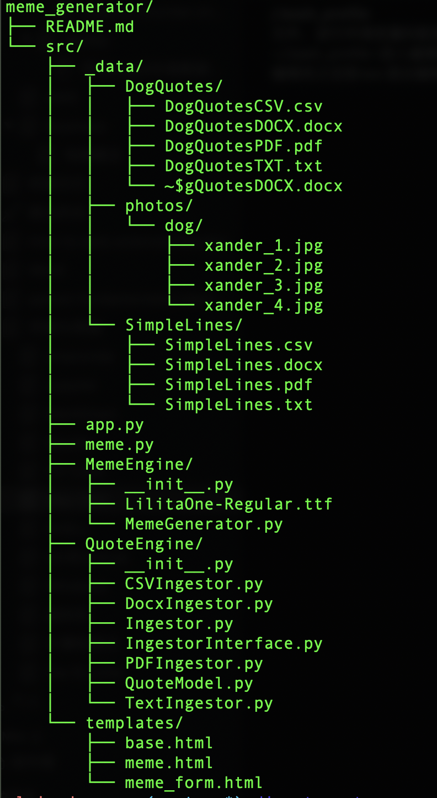
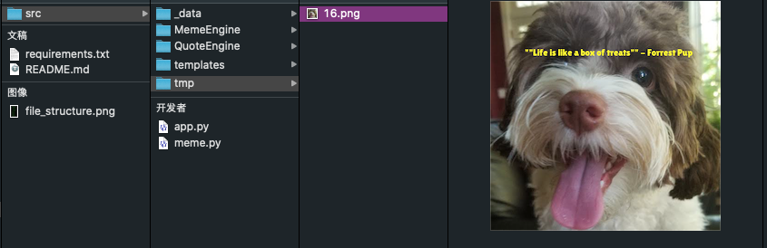
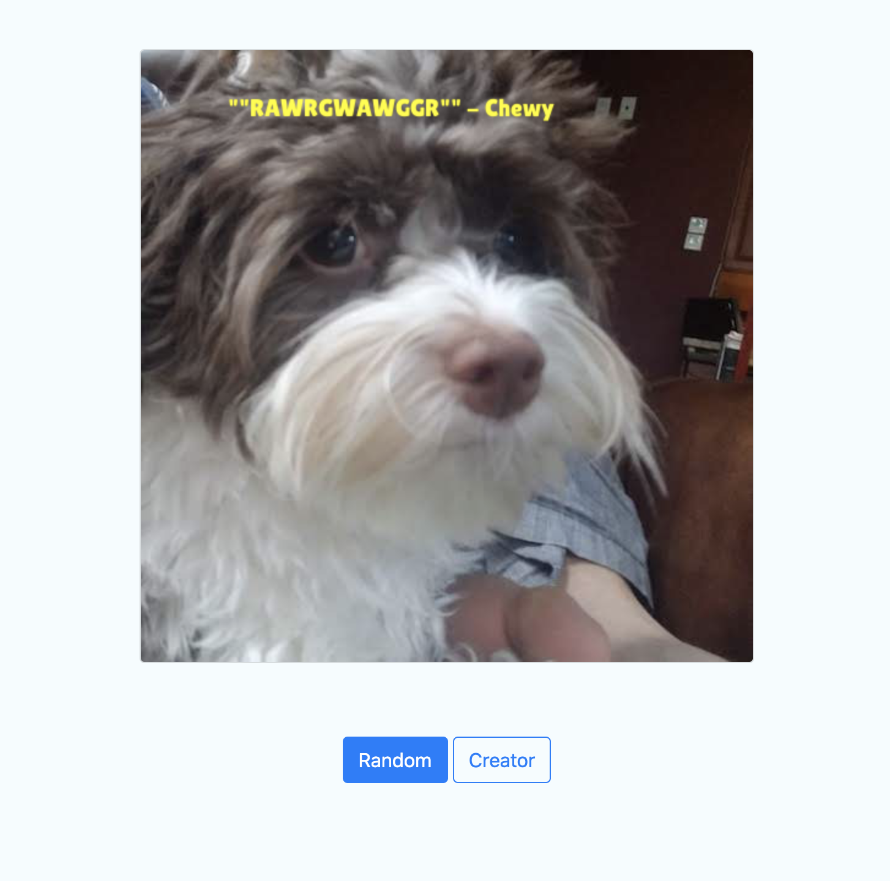

# Motivational Meme Generator

## Project Overview
The goal of this project is to build a "meme generator" – a multimedia application to dynamically generate memes, including an image with an overlaid quote.

The main tasks for this project are as follows:
- Interact with a variety of complex filetypes.
- Load quotes from a variety of filetypes (`PDF`, Word Documents (or `docx`), `CSV`s, Text (`txt`) files).
- Load, manipulate, and save images.
- Accept dynamic user input through a command-line tool and a web service. 

This project encapsulated some of the most classic and important ideas and good conventions in computer programming, not only for Python, such as
- **Object-oriented thinking**, including abstract classes, class methods, and static methods.
- **DRY (don’t repeat yourself)** principles of class and method design.
- Working with **modules and packages** to break down complex scenarios into small pieces.

## Structure and Functionality Under Each Module

The file structure for the whole project is as follows:



I'd like to explain a little bit more about the files under `/src` folder.
The data that are consumed by this project are all from `src/_data` folder:
1. The words which need to be overlaid on the meme picture are all extracted from the files with different formats under `/DogQuotes`.
2. Pictures that are randomly selected during runtime are from `/photos/dog`. Files under `/SimpleLines` will give you a quick view about the structure and contents we will process under `DogQuotes` folder.

Modules under `MemeEngine`, `QuoteEngine` and `templates` aim for three main functionalities and workflows when building this project:

1. `QuoteEnigine` is responsible for extracting the word contents by parsing the files with different formats. For example, `CSVIngestor.py` is for parsing the `.csv` file, `PDFIngestor` is for parsing the `.pdf` file and so on. One more thing, the words that are overlaid on the picture consist of two parts: **body** + **author** (see below), so `QuoteModel.py` is used to combine these two parts as an object.
```
"This is a quote body" - Author
```

2. `MemeEngine` is responsible for manipulating and drawing text onto images. It allows to make transformations on the images such as resizing to some extent.
3. `templates` is a simple interactive web interface. Two ways to generate memes are allowed. Users can create the by consuming the data already provided. The other way is to create a meme by your self - by justing adding a url to your favorite image and typing your beloved quotes!
4. `meme.py` right under `/src` provides a CLI (Command line Interface) to users for interaction. `app.py` utilize the `templates` to create a web interface for users to interact with.

 
 ## How to Use
 The usage of this program is quite simple, but a few preparatory steps must be performed.
 ### 1. Environment Setup
 This project is built on Python3.*. All dependencies are listed in `requirements.txt` under the root folder. A third party utility called `xpdf` is used. Users can download it <a href="https://www.xpdfreader.com/download.html">here</a>. It provides easy commands directly on CLI. Be sure to refer to its website mentioned above to complete its installation in advance.
 ___Recommendation:___ You can set up a virtual environment for executing this program. For example:
 ```
$ python -m venv meme_generator_project
$ source meme_generator_project/bin/activate
 ```

After the installation, we can run this program. As mentioned above, there are two ways to generate the memes.
### 2. Run the Program via Command Line

one way is to use the command line interface:
```
$ python meme.py [--body] [--author] [--path] 
```
- body a string quote body
- author a string quote author
- path an image path

However, the three arguments above are optional. By default, the program will automatically extract quotes and images from files under the project folder. Each time after execution, you can find the final meme under the `tmp` folder.


### 3. Run the Program through Web
The other way to generate the memes is via a web interface. First, type in the following command in the terminal to start up the web service:
```
$ python app.py
```

<br></br>

Likewise, the generated meme will be stored under a folder called `static`.

<br></br>

## Acknowledgement
The material for this project is provided by <a href="https://www.udacity.com/">Udacity</a>, a ___distinguished, world-class___ online teaching organization for computer engineering and data science. This portfolio is inspired by Capstone Project of <a href="https://www.udacity.com/course/intermediate-python-nanodegree--nd303">Intermediate Python Nanodegree Program</a>.
